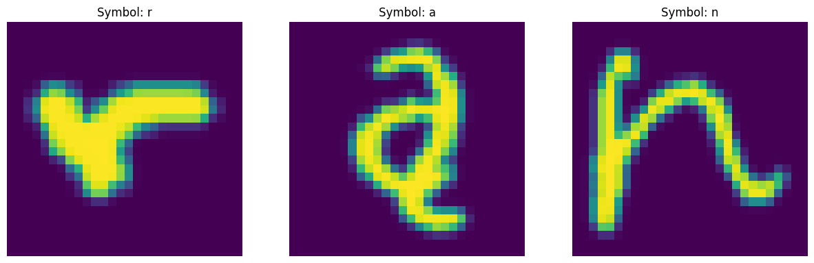
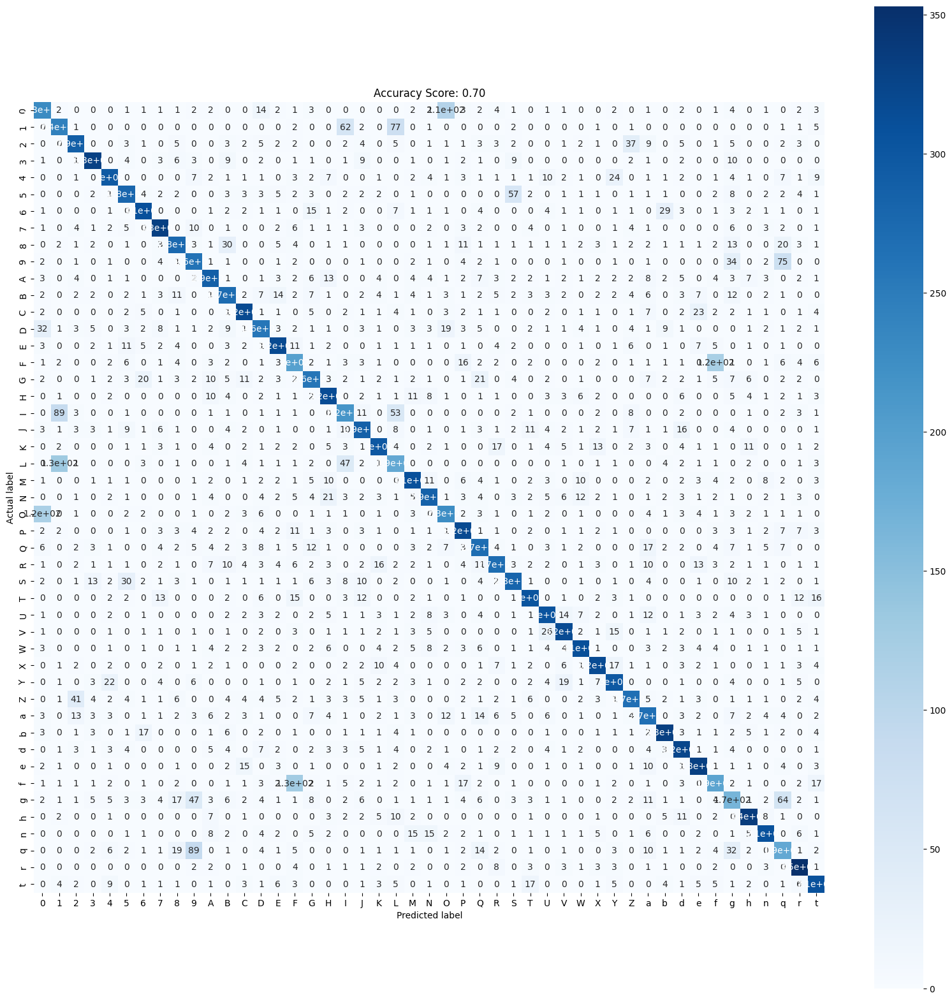

# Распознавание рукописных символов EMNIST

## 1. Описание решения
- **Тип задачи:**   
_Задача классификации на датасете рукописных символов EMNIST._

- **Описание данных:**  
_Данные для обучения включают тренировочную и тестовую выборки, содержащие 112 800 и 18 800 изображений рукописных символов размером 28х28 пикселей в формате массивов._   
_В каждом наборе данных метки представлены числами от 0 до 46, где каждой метке соответствует ASCII-код определенного символа._
_Соответствие «метка — код символа» указано в файле emnist-balanced-mapping.txt._



- **Выбранная модель:**  
_*HistGradientBoostingClassifier* - Дерево классификации градиентного бустинга на основе гистограммы от Scikit-learn, со стоковыми гиперпараметрами._

- **Метрики на тестовых данных:**  
accuracy score: 0.7


## 2. Установка и запуск сервиса

```bash
git clone https://github.com/MawneIl/emnist-symbol-detector.git
cd emnist-symbol-detector
docker built -t myapp
docker run -p 8000:8000 myapp
```
